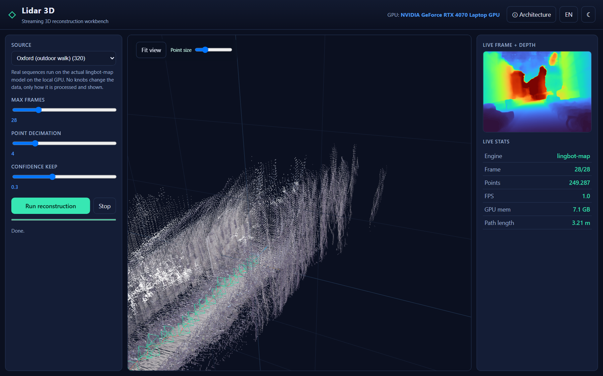

# CAOS_RES_Lidar3D — streaming 3D reconstruction lab

[](https://github.com/fsantibanezleal/CAOS_RES_Lidar3D/actions)
[](LICENSE)
[](https://github.com/fsantibanezleal/CAOS_RES_Lidar3D/tags)
[](https://lidar3d.fasl-work.com)

> **Lidar 3D** turns camera (and depth-sensor) streams into camera trajectories, dense metric depth, and RGB
> point clouds. Two model tracks on every scenario the data supports: **Track A, RGB-only** (Estela, our own
> trained depth+pose net, plus **lingbot-map**, arXiv:2604.14141, the 2026 streaming pointmap SOTA reference,
> Apache-2.0) and **Track B, RGB + sensor depth** (metric by construction), against a classical ICP baseline.
> Instantiated from the CAOS product archetype (ADR-0057).



Research repo: local-first, heavy models/data on a scratch volume (env-resolved, never in git).
**Status: v0.13.006 (live).** The App is organized **scenario-first**: pick the input data (RGB + depth /
RGB only / LiDAR only), then apply every method that data supports and compare the outcomes on the same
frames. Two model tracks plus the classical baseline, all measured against ground truth (umeyama rigid ATE,
240 frames):

| scenario | Track A: RGB-only (Estela) | Track B: RGB + sensor depth | classical depth-only ICP |
|---|---|---|---|
| TUM desk | 0.137 m | **0.041 m** | 0.063 m |
| TUM long office (held-out) | 0.198 m | 0.077 m | **0.041 m** |
| TUM wide desk loop | 0.119 m | **0.016 m** | 0.075 m |
| TUM xyz calibration | 0.184 m | 0.025 m | **0.020 m** |
| TUM robot SLAM run | 0.115 m | **0.039 m** | 0.128 m |

No method dominates: sparse RGB features + PnP (Track B) win where texture is strong; dense depth ICP
absorbs sensor noise at range; RGB-only carries the monocular scale ambiguity (the measured blocker, see
`docs/models/`). That honest tradeoff is the point of the side-by-side. The RGB-only pointmap SOTA
reference (lingbot-map) runs on 4 additional video-only scenes.

## Three lanes (ADR-0057), and why the public web is replay, not live

The reconstruction engines need a local GPU (the pointmap reference is a ~1B-parameter ViT at ~7 GB VRAM;
Estela and the RGB-D geometry also run on CUDA), so real-time inference cannot run inside a static browser
page. The lab therefore separates:

| Lane | What | Where |
|---|---|---|
| **Offline / precompute** | ALL the engines bake committed, reproducible artifacts: **Estela** (ours, trained), **rgbd-sensor** + **depth-icp** (Track B + classical), **lingbot-map** (pointmap SOTA reference), classical LiDAR ICP, and the synthetic control | `data-pipeline/lidar3dlab/stages` (GPU/CPU per engine) |
| **Replay (public web)** | the static SPA renders those artifacts (what you see at the demo URL) | `frontend/` (GitHub Pages) |
| **Live** | real-time reconstruction of your own footage with any registered engine | `app/` local-GPU FastAPI (run it next to your GPU; see below) |

## Quickstart

```bash
# 1. Environment (Python 3.12 .venv + the precompute deps; torch + the vendored engine per docs/frameworks/lingbot-map)
scripts/setup.ps1                                   # or: bash scripts/setup.sh
# 2. Bake the synthetic CPU case (no GPU/model needed) — proves the pipeline end-to-end
.venv/Scripts/python.exe -m lidar3dlab.pipeline SYN_orbit
# 3. Bake a real sequence (needs the GPU + the env paths from the vault)
LIDAR3D_MODELS_ROOT=… LIDAR3D_DATA_ROOT=… .venv/Scripts/python.exe -m lidar3dlab.pipeline oxford
# 4. The replay web app
cd frontend && npm install && npm run build && npm run preview
```

There is **no root `run_app.py`**: the pipeline is `python -m lidar3dlab.pipeline <case>`. The frontend
replays the committed artifacts (`copy-data.mjs` enforces the artifact contract).

## Live mode: reconstruct your own footage (local GPU)

The public page is replay-only because the engines need CUDA; the LIVE lane is a local API you run next to
your GPU:

```bash
.venv/Scripts/python.exe -m uvicorn app.main:app --port 8000
# which engines can run on this machine (CUDA detection):
curl localhost:8000/api/live/health
# reconstruct a folder of ordered RGB frames (Estela, RGB-only):
curl -X POST localhost:8000/api/live/reconstruct -H "Content-Type: application/json" \
     -d '{"source_dir": "C:/footage/my_sweep", "engine": "own-depthpose", "max_frames": 120}'
# or a TUM-layout RGB-D root with the Track B engine (metric by construction):
curl -X POST localhost:8000/api/live/reconstruct -H "Content-Type: application/json" \
     -d '{"source_dir": "C:/footage/my_rgbd_root", "engine": "rgbd-sensor"}'
```

Measured on an RTX 4070 Laptop (8 GB): `rgbd-sensor` reconstructs 30 RGB-D frames in ~2.3 s; the pointmap
reference (`lingbot`) streams ~1 s/frame at the 8 GB-safe config. `include_trace: true` returns the full
point cloud (base64 float32) for your own renderer.

## What works (verified 2026-07-06)

- **Real engines in a compliant staged pipeline**: `preprocess → feature_extraction → train(ACTIVE for Estela) →
  infer → refine(color/texture) → evaluate → export`, with the two enforced data contracts (RGB-sequence
  ingestion + the artifact manifest, mirrored by the TS types) and the measured lane gate.
- **Verified bakes (24 cases)**: 5 TUM RGB-D scenarios x the 3-method matrix (Estela / rgbd-sensor /
  depth-icp) + 7-Scenes + ICL (Estela) + 4 video-only scenes (lingbot-map, 8 GB-safe: SDPA, CPU-offload,
  window=16, bf16) + LiDAR + synthetic controls. No personal paths are ever committed.
- **Frontend (ADR-0016 + ADR-0058)**: a 6-page shell (App / Introduction / Methodology / Implementation /
  Experiments / Benchmark), header with nav + github/personal/portfolio icons + EN/ES + light/dark + the ⓘ
  architecture modal, footer; the App is a workbench with a **three.js RGB-colored point-cloud viewer** +
  camera-frustum trajectory + per-frame depth + stats. Screenshot-verified, zero JS errors.
- **Tests + CI**: ruff + pytest (the synthetic case is the CI smoke) + the CONTRACT-2 drift guard + the
  base-integrity guards (no `.env`, no venv/binaries, no leaked machine paths).

## Layout (instantiated from `template_repo_product`, ADR-0057)

```
data-pipeline/lidar3dlab/   engine + staged pipeline: io/{schema,contract,formats} · core/{gate,manifest,
                            trace,rng} · model/{geometry,synthetic,lingbot} · stages/* · cases · pipeline.py
frontend/                   the replay SPA (React 19 + Vite + three.js + KaTeX)
app/                        LIVE local-GPU FastAPI (POST /api/live/reconstruct on your own footage)
data/derived + manifests/   committed compact artifacts (CONTRACT 2)
docs/                       architecture · frameworks/lingbot-map · cases · guides · research (surveys)
tests/ · .github/workflows/ pytest + ruff + pipeline smoke + guards
third_party/lingbot-map/    the vendored engine (Apache-2.0)
```

## Roadmap (the novel agenda)

Beyond using SOTA, the lab pursues lingbot-map's three stated gaps: **loop closure** (pose-graph over the
trajectory memory), **camera↔LiDAR fusion**, and **test-time refinement** (textured mesh / 3DGS). Each is
evaluated rigorously, null results kept. See `docs/research/` for the published surveys and findings.

## Credits / license

Built around **lingbot-map** (arXiv:2604.14141, Apache-2.0), vendored under `third_party/`. This repository
is licensed under **Apache-2.0** (see `LICENSE`). The vendored engine and any model weights keep their own
licenses, tracked per-engine (some are non-commercial, flagged before any product use).
